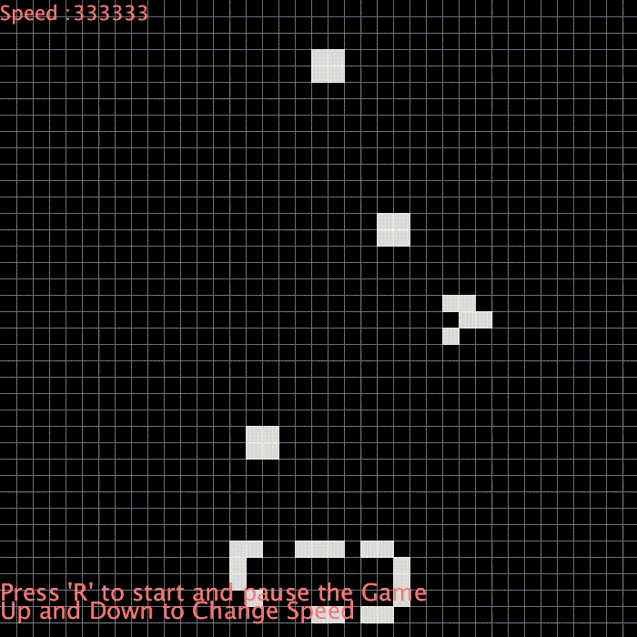

# Conway-Game-of-Life-Processing

  
  

My basic implementation of Conway's Game of Life in Processing, the cellular automaton created by the British mathematician John Horton Conway.

[Wikipedia article](https://en.wikipedia.org/wiki/Conway%27s_Game_of_Life)

[Very Interesting interview to the creator of the Game of Life](https://www.youtube.com/watch?v=R9Plq-D1gEk)
